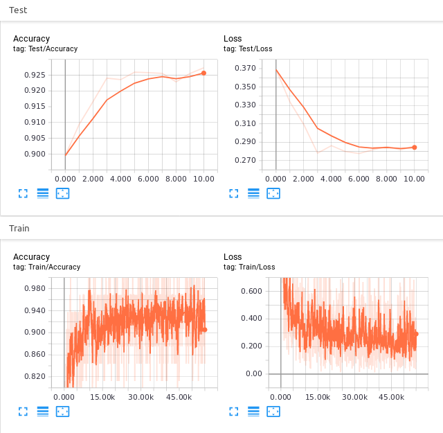

<div align="center">
  
</div>

<h1 align="center">Quick Draw! 🖌️</h1>

<p align="center">
  <strong>A neural network-based drawing classification project using Google's Quick, Draw! dataset.</strong>
</p>

<p align="center">
  <a href="#-introduction">Introduction</a> •
  <a href="#-dataset">Dataset</a> •
  <a href="#-categories">Categories</a> •
  <a href="#-training">Training</a> •
  <a href="#-experiments">Experiments</a> •
  <a href="#-demo">Demo</a> •
  <a href="#-requirements">Requirements</a> •
  <a href="#-installation">Installation</a> •
  <a href="#-usage">Usage</a> •
  <a href="#-contributing">Contributing</a>
</p>

<p align="center">
  
  
  
<!--    -->
</p>

## 🚀 Introduction

**Quick Draw** is an exciting project that utilizes Google's *Quick, Draw!* dataset, featuring millions of hand-drawn sketches. This project builds a neural network model to classify doodles into **20** different categories, each with **10,000** images.

After **20** epochs of training, the model achieved a test loss of **0.37** and an accuracy of **89.9%**. The project culminates in a real-time drawing application built with **OpenCV**, providing instant predictions for user sketches.

## 📊 Dataset

You can view and download the data from the following link: [QuickDraw Dataset](https://console.cloud.google.com/storage/browser/quickdraw_dataset/sketchrnn)

## 🏷 Categories

Below is the list of 20 labels used to train the model:

| Column 1 | Column 2 | Column 3 | Column 4 |
|:--------:|:--------:|:--------:|:--------:|
| 🍎 apple | 📚 book | 🎀 bowtie | 🕯️ candle |
| ☁️ cloud | ☕ cup | 🚪 door | ✉️ envelope |
| 👓 eyeglasses | 🎸 guitar | 🔨 hammer | 🎩 hat |
| 🍦 ice cream | 🍃 leaf | ✂️ scissors | ⭐ star |
| 👕 t-shirt | 👖 pants | ⚡ lightning | 🌳 tree |

## 🏋 Training

To train the model, you need to download the `.npz` files corresponding to the 20 classes used and store them in the **data** folder. If you want to train your model with a different list of categories, you only need to change the constant **CLASSES** in `./src/config.py` and download the necessary `.npz` files. Then, simply run:

```python
python train.py
```

## 🧪 Experiments

For each class, I selected the first 10,000 images and split them into training and test sets with a ratio of 8:2. The training and test loss/accuracy curves for the experiment are shown below:
<p align="center">
  </br>
  <em>Experiments</em>
</p>

## 🎮 Demo

To run the demo application, use the command:
```python
python painting_app.py
```
<p align="center">
 </br>
  <em>Demo</em>
</p>

## 📋 Requirements

- Python 3.12
- OpenCV 4.10
- PyTorch 2.3.1
- NumPy

## 💻 Installation

1. Clone the repository:
```bash
git clone https://github.com/hieplt23/quick_draw.git
cd quick_draw
```
2. Create a virtual environment (optional but recommended):
```bash
python -m venv .venv
source .venv/bin/activate  # On Windows, use: .venv\Scripts\activate
```
3. Install the dependencies:
```bash
pip install -r requirements.txt
```

## 🖥 Usage

1. Train the model: ``python train.py``
2. Run the demo application: ``python painting_app.py``

## 🤝 Contributing

Contributions are always welcome! Please read the contribution guidelines for more information on how you can help improve this project.
