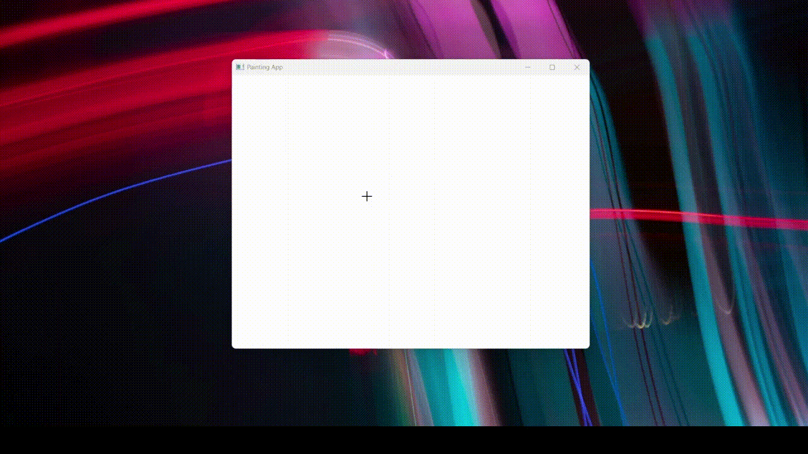
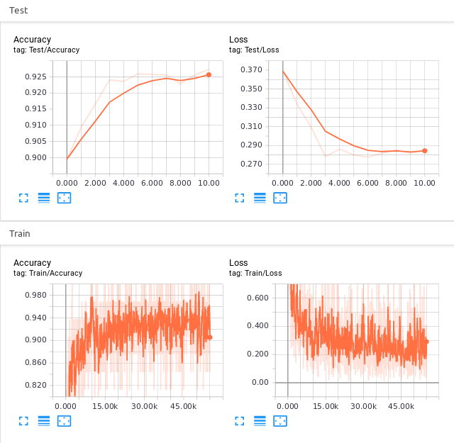

<div align="center">
  
</div>

<h1 align="center">Quick Draw! 🖌️</h1>

<p align="center">
  <strong>A neural network-based drawing classification project using Google's Quick, Draw! dataset.</strong>
</p>

<p align="center">
  <a href="#-demo">Demo</a> •
  <a href="#-introduction">Introduction</a> •
  <a href="#-dataset">Dataset</a> •
  <a href="#-categories">Categories</a> •
  <a href="#-training">Training</a> •
  <a href="#-experiments">Experiments</a> •
  <a href="#-docker-support">Docker Support</a> •
  <a href="#-requirements">Requirements</a> •
  <a href="#-installation">Installation</a> •
  <a href="#-usage">Usage</a> •
  <a href="#-contributing">Contributing</a>
</p>

<p align="center">
  
  
  
<!--    -->
</p>

## 🎮 Demo

Launch the real-time drawing app with a single command:
```bash
python painting_app.py
```
<p align="center">
 </br>
  <em>Demo</em>
</p>

## 🚀 Introduction

**Quick Draw** is an exciting project that utilizes Google's *Quick, Draw!* dataset, featuring millions of hand-drawn sketches. This project builds a neural network model to classify doodles into **20** different categories, each with **10,000** images.

After **20** epochs of training, the model achieved a test loss of **0.37** and an accuracy of **89.9%**. The project culminates in a real-time drawing application built with **OpenCV**, providing instant predictions for user sketches.

## 📊 Dataset

Dive into the data that fuels this project! Explore and download the Quick, Draw! dataset here: [QuickDraw Dataset](https://console.cloud.google.com/storage/browser/quickdraw_dataset/sketchrnn)

## 🏷 Categories

Our model recognizes 20 fun and diverse categories. Here’s the full lineup::

| Categories | Categories | Categories | Categories |
|:--------:|:--------:|:--------:|:--------:|
| 🍎 apple | 📚 book | 🎀 bowtie | 🕯️ candle |
| ☁️ cloud | ☕ cup | 🚪 door | ✉️ envelope |
| 👓 eyeglasses | 🎸 guitar | 🔨 hammer | 🎩 hat |
| 🍦 ice cream | 🍃 leaf | ✂️ scissors | ⭐ star |
| 👕 t-shirt | 👖 pants | ⚡ lightning | 🌳 tree |

## 🏋 Training

Ready to train your own doodle classifier? Download the `.npz` files for the 20 categories and place them in the `data` folder. Want to mix it up with your own categories? Simply tweak the `CLASSES` constant in `./src/config.py`, grab the relevant `.npz` files, and fire up the training:
```bash
python train.py
```

## 🧪 Experiments

For each class, I selected the first 10,000 images and split them into training and test sets with a ratio of 8:2. The training and test loss/accuracy curves for the experiment are shown below:
<p align="center">
  </br>
  <em>Experiments</em>
</p>

## 🐳 Docker Support

Take your project to the next level with Docker! We’ve included a custom **Dockerfile** to streamline setup and ensure consistency across environments—perfect for development, testing or deployment.

### Quick Start with Docker
1. **Build the Image**:
   ```bash
   docker build -t quick-draw -f Dockerfile .
   ```
2. **Run the Container:**
   ```bash
   docker run -it quick-draw bash
   ```

## 📋 Requirements

- Python 3.12
- OpenCV 4.10
- PyTorch 2.3
- NumPy

## 💻 Installation

1. Clone the repository:
```bash
git clone https://github.com/hieplt23/quick_draw.git
cd quick_draw
```
2. Create a virtual environment (optional):
```bash
python -m venv .venv
.venv\Scripts\activate # on windows
```
3. Install the dependencies:
```bash
pip install -r requirements.txt
```

## 🖥 Usage

1. Train the model: ``python train.py``
2. Run the demo application: ``python painting_app.py``

## 🤝 Contributing

Contributions are always welcome!
